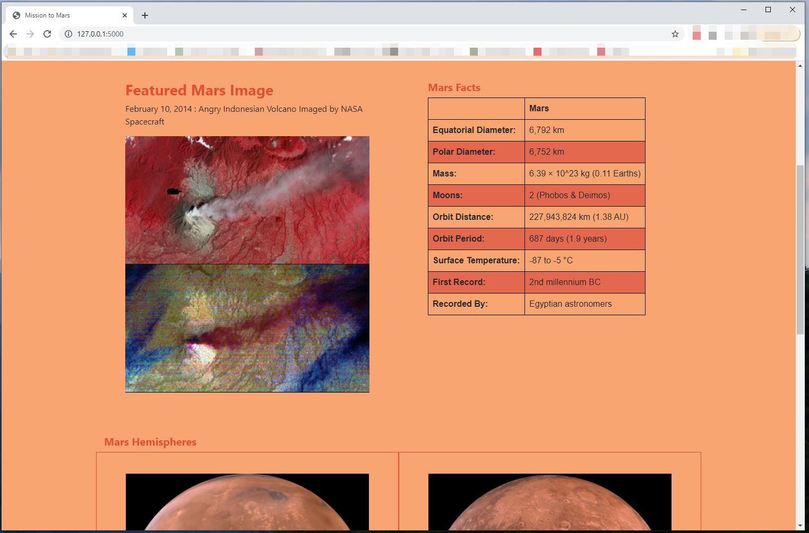

# web-scraping: Mission to Mars

Flask web application that scrapes four separate websites for data related to the Mission to Mars, then displays the information locally on a single HTML page.  BeautifulSoup and Splinter primarily used to find and parse out necessary data; PyMongo utilized for interacting with the database, Bootstrap framework to structure the HTML template.

- - -

### Images and Files

The following images are screenshots of the final application.

**mission_to_mars.ipynb:** notebook containing the initial scraping code used in the application.  Information was scraped from the following four sources:

https://mars.nasa.gov/news/ (NASA Mars News)

https://www.jpl.nasa.gov/spaceimages/?search=&category=Mars (JPL Mars Space Images)

https://space-facts.com/mars/ (Mars Facts)

https://astrogeology.usgs.gov/search/results?q=hemisphere+enhanced&k1=target&v1=Mars (Mars Hemispheres)

**scrape_mars.py:** contains a function called 'scrape' that will execute all of the scraping code from the above notebook, and return one Python dictionary containing all of the scraped data.

**app.py:** contains flask application with a root route that will query the Mongo database and pass the mars data into an HTML template to display the data.  The /scrape route will import the scrape_mars.py script and call the 'scrape' function.  The existing document in the database is overwritten each time the /scrape button is clicked and new data is obtained.